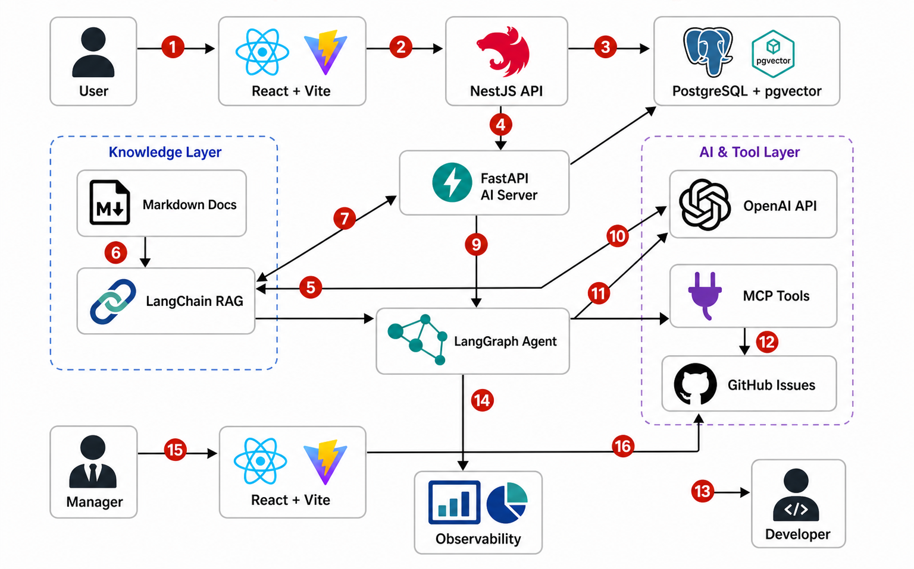
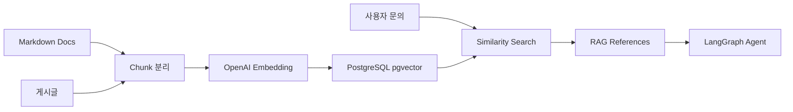
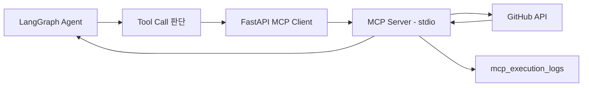
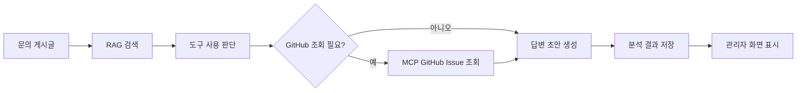
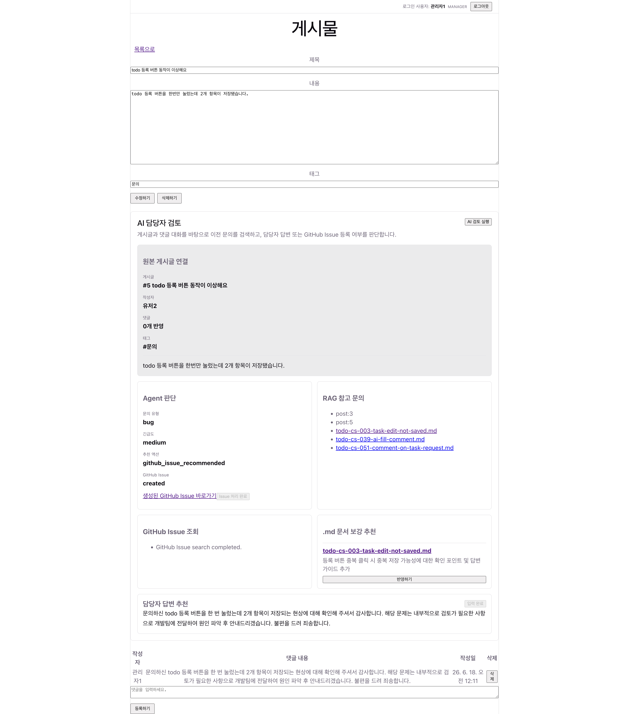
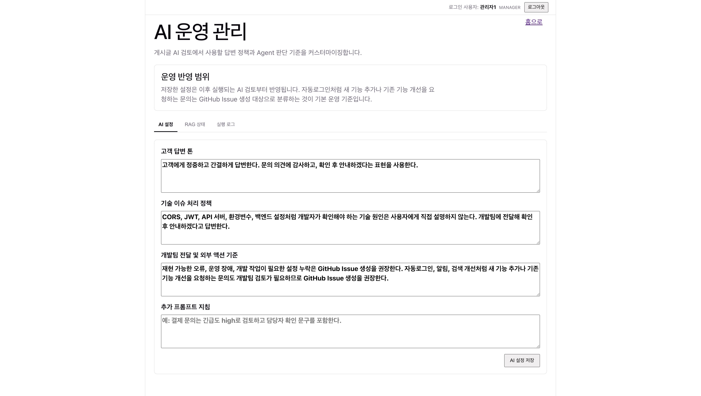
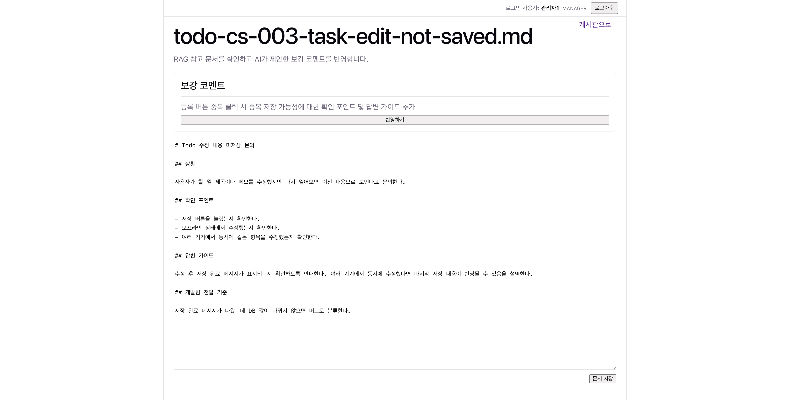

# AI Helpdesk Board

React, NestJS, PostgreSQL, FastAPI, RAG, MCP, LangGraph Agent를 연결한 AI 기반 문의 게시판입니다.

사용자가 문의 게시글을 작성하면 서버가 AI 검토를 자동으로 준비하고, Agent가 RAG 문서 검색과 GitHub Issue 조회 결과를 바탕으로 답변 초안을 생성합니다. 관리자는 생성된 초안을 검토해 댓글로 등록하고, 개발 작업이 필요한 경우 GitHub Issue 생성을 승인할 수 있습니다.

## 1. 프로젝트 개요

이 프로젝트는 단순 게시판에 LLM 응답을 붙이는 것이 아니라, 실제 고객 문의 처리 흐름을 AI Agent 기반 업무 흐름으로 구성하는 것을 목표로 합니다.

핵심 문제는 반복 문의 처리, 유사 사례 검색, 외부 이슈 상태 확인, 답변 초안 작성, 개발팀 전달 과정을 한 화면에서 관리하는 것입니다.

주요 사용자:

- 일반 사용자: 문의 게시글 작성, 댓글 확인
- 관리자: AI 검토 결과 확인, 답변 초안 수정, GitHub Issue 생성 승인
- 개발자: GitHub Issue를 통해 후속 개발 작업 관리

기술 스택:

| 영역 | 기술 | 역할 |
|---|---|---|
| Frontend | React, TypeScript, Vite | 게시판 화면, 관리자 AI 검토 UI |
| Backend | NestJS, TypeORM | 인증, 게시판 CRUD, 댓글, 태그, AI 서버 프록시 |
| AI Server | FastAPI | RAG, MCP, Agent, 관찰 로그 처리 |
| Database | PostgreSQL | 사용자, 게시글, 댓글, 문의, 분석 결과, 실행 로그 저장 |
| Vector DB | PostgreSQL pgvector | RAG 문서와 게시글 embedding 저장 및 유사도 검색 |
| RAG | LangChain, PGVector | 내부 문서와 과거 문의 검색 |
| MCP | MCP Python SDK, JSON-RPC | GitHub Issue 조회/생성 도구화 |
| Agent | LangGraph | RAG, MCP, LLM 호출 흐름 제어 |
| LLM | OpenAI API | embedding 생성, 답변 초안 생성, 문의 분류 |

## 2. 주요 구현 기능

기본 게시판 기능:

- 회원가입, 로그인
- JWT 기반 인증
- `USER` / `MANAGER` 역할 구분
- 게시글 생성, 목록 조회, 상세 조회, 수정, 삭제
- 댓글 작성, 목록 조회, 삭제
- 태그 입력과 표시
- 게시글 검색과 페이징

AI 문의 처리 기능:

- 게시글 작성/수정 직후 RAG embedding 동기화
- 게시글 기반 AI 문의 자동 생성
- FastAPI Agent 분석 백그라운드 실행
- RAG 참고 문서와 과거 게시글 검색
- GitHub Issue 유사 사례 조회
- 답변 초안, 문의 유형, 긴급도, 추천 액션 생성
- 관리자 화면에서 AI 검토 결과 조회
- 답변 초안을 댓글 입력창에 자동 채우기
- 관리자 승인 후 GitHub Issue 생성

운영 관리 기능:

- AI 답변 톤과 처리 정책 설정
- RAG 문서 적재 상태 조회
- Agent 단계별 실행 로그 저장
- MCP 요청/응답 payload 저장
- FastAPI API 응답 시간, 실패율, MCP 실패율 요약

## 3. 전체 아키텍처 구조

아래 다이어그램은 현재 프로젝트의 주요 컴포넌트와 데이터 흐름을 나타냅니다.



전체 흐름:

1. 사용자가 React 화면에서 문의 게시글을 작성합니다.
2. React는 JWT를 포함해 NestJS API로 요청을 보냅니다.
3. NestJS는 게시글, 댓글, 태그를 PostgreSQL에 저장합니다.
4. NestJS는 FastAPI AI 서버에 게시글 embedding 동기화와 AI 검토 생성을 요청합니다.
5. FastAPI는 LangChain RAG로 관련 문서와 과거 문의를 검색합니다.
6. LangGraph Agent는 RAG 검색 결과를 근거로 문의 유형, 긴급도, 답변 초안을 생성합니다.
7. Agent가 외부 이슈 확인이 필요하다고 판단하면 MCP Tools를 통해 GitHub Issue를 조회합니다.
8. 분석 결과와 실행 로그는 PostgreSQL에 저장됩니다.
9. 관리자는 React 화면에서 AI 검토 결과를 확인하고 답변 초안을 댓글로 등록합니다.
10. 개발 작업이 필요한 경우 관리자가 승인한 뒤 GitHub Issue를 생성합니다.

OpenAI API는 하나의 외부 서비스로 사용합니다. RAG에서는 embedding 생성에 사용하고, Agent에서는 답변 초안 생성과 판단에 사용합니다.

## 4. 각 AI 활용 기능, 기술, 아키텍처 구조

### RAG 기능

RAG는 AI가 답변을 만들기 전에 내부 문서와 과거 문의를 검색해 근거 context를 제공하는 기능입니다.

사용 기술:

- LangChain
- OpenAI `text-embedding-3-small`
- PostgreSQL pgvector
- Markdown 문서 loader
- RecursiveCharacterTextSplitter

데이터 소스:

- `ai-server/ai-inquiry-rag-server/docs/*.md`
- 게시판 게시글

처리 구조:



구현 포인트:

- 게시글 생성/수정 시 FastAPI에 embedding 동기화 요청
- 게시글 삭제 시 관련 vector chunk 제거
- 문의 제목과 본문을 검색 query로 구성
- 검색 결과의 source metadata를 답변 초안과 함께 관리자 화면에 표시

### MCP 기능

MCP는 AI Agent가 외부 시스템을 도구처럼 사용할 수 있게 하는 연결 계층입니다. 이 프로젝트에서는 GitHub Issue 조회와 생성을 담당합니다.

사용 기술:

- MCP Python SDK
- JSON-RPC
- stdio transport
- GitHub API

구현 도구:

- `search_github_issues`: 유사 GitHub Issue 조회
- `create_github_issue_with_project`: GitHub Issue 생성 및 Project 등록

처리 구조:



구현 포인트:

- GitHub Issue 검색은 Agent 답변 초안 생성 전에 수행
- GitHub Issue 생성은 자동 실행하지 않고 관리자 승인 후 실행
- 모든 MCP 요청/응답 payload를 `mcp_execution_logs`에 저장
- `GITHUB_TOKEN`, repository 설정은 환경 변수로 관리

### Agent 기능

Agent는 RAG 검색, 도구 사용 판단, MCP 실행 결과 반영, 답변 초안 생성을 하나의 상태 흐름으로 제어합니다.

사용 기술:

- LangGraph
- OpenAI Chat API
- OpenAI Function Calling
- FastAPI service layer
- PostgreSQL 실행 로그 테이블

처리 구조:



Agent가 생성하는 주요 결과:

- 문의 유형
- 긴급도
- 답변 초안
- 추천 액션
- RAG references
- MCP 검색 결과
- 문서 보강 추천

무한 루프 방지와 운영 안정성:

- `tool_loop_count`로 도구 반복 횟수 제한
- `tool_loop_complete` 상태로 종료 조건 명시
- RAG, MCP, LLM 단계별 예외와 처리 시간을 로그로 저장
- 최신 AI 검토 결과가 이미 있으면 중복 분석을 피하고 기존 결과를 재사용

## 5. 데모

### 실행 방법

PostgreSQL + pgvector 실행:

```bash
cd infra/postgres-pgvector
docker compose up -d
```

AI 서버 실행:

```bash
cd ai-server/ai-inquiry-rag-server
python -m venv .venv
source .venv/bin/activate
python -m pip install -r requirements.txt
cp .env.example .env
python scripts/ingest_docs.py
uvicorn app.main:app --reload
```

NestJS API 실행:

```bash
cd server/basic-server
npm install
npm run start:dev
```

React 클라이언트 실행:

```bash
cd client/basic-client
npm install
npm run dev
```

### 데모 시나리오

1. 일반 사용자가 회원가입 후 로그인합니다.
2. 문의성 게시글을 작성합니다.
3. 서버가 게시글 저장 후 RAG embedding과 AI 검토 생성을 자동으로 준비합니다.
4. 관리자가 게시글 상세 화면에 접근합니다.
5. 관리자 AI 검토 패널에서 RAG 참고 문서, GitHub Issue 조회 결과, 답변 초안을 확인합니다.
6. 관리자가 답변 초안을 댓글 입력창에 채운 뒤 수정해 등록합니다.
7. 개발 작업이 필요한 문의는 GitHub Issue 생성을 승인합니다.
8. 관리자 AI 화면에서 RAG 상태와 Agent/MCP/API 실행 로그를 확인합니다.

### 스크린샷

| 화면 | 설명 | 스크린샷 |
|---|---|---|
| 게시글 상세와 AI 담당자 검토 | 문의 게시글 상세 화면에서 Agent 판단, RAG 참고 문서, GitHub Issue 조회 결과, 답변 초안을 확인하고 댓글로 등록하는 화면입니다. |  |
| AI 운영 관리 | 관리자가 AI 답변 톤, 기술 이슈 처리 정책, GitHub Issue 생성 기준, 추가 프롬프트 지침을 설정하는 화면입니다. |  |
| RAG 문서 보강 편집 | AI가 추천한 보강 코멘트를 참고해 Markdown RAG 문서를 직접 확인하고 수정하는 화면입니다. |  |

## 6. 회고, 한계점, 그리고 개선 아이디어

### 회고

이 프로젝트를 통해 RAG, MCP, Agent를 각각 독립 기능으로만 보는 것이 아니라 하나의 문의 처리 업무 흐름으로 연결해 볼 수 있었습니다.

특히 단순히 LLM 답변을 출력하는 방식보다, 게시판 데이터 저장, RAG 근거 검색, 외부 도구 호출, 관리자 승인, 실행 로그 저장까지 연결했을 때 실제 서비스에 가까운 구조가 된다는 점을 확인했습니다.

또한 OpenAI API는 하나의 외부 AI 서비스지만, embedding 생성과 답변 초안 생성이라는 서로 다른 책임으로 사용된다는 점을 아키텍처에서 분리해 이해할 수 있었습니다.

### 한계점

- AI 검토 자동 준비는 현재 NestJS 프로세스 내부의 best-effort 백그라운드 실행입니다.
- 운영 환경에서는 BullMQ, Redis 같은 작업 큐를 사용해야 재시도와 장애 복구가 안정적입니다.
- RAG 데이터는 Markdown 문서와 게시글 중심이며, 댓글 변경까지 실시간 embedding에 반영하는 구조는 더 보완할 수 있습니다.
- GitHub Issue 연동은 token, repository, project 권한 설정에 의존합니다.
- LLM 답변 품질은 RAG 문서 품질과 프롬프트 품질에 크게 영향을 받습니다.
- 관리자 화면은 학습용 운영 도구 수준이며, 실제 운영에서는 기간 필터, 상세 검색, 차트, alert 기능이 필요합니다.

### 개선 아이디어

- 게시글 작성 중 실시간 유사 문의 추천
- 댓글 변경 시 관련 게시글 embedding 재생성
- GitHub뿐 아니라 Jira, Slack, Notion 등 추가 MCP tool 연동
- Agent 단계별 trace 상세 화면 제공
- 운영 지표 차트화와 실패 알림
- 답변 초안 승인 이력 관리
- 문의 처리 상태별 사용자 알림
- RAG 문서 품질 평가와 자동 보강 워크플로우
