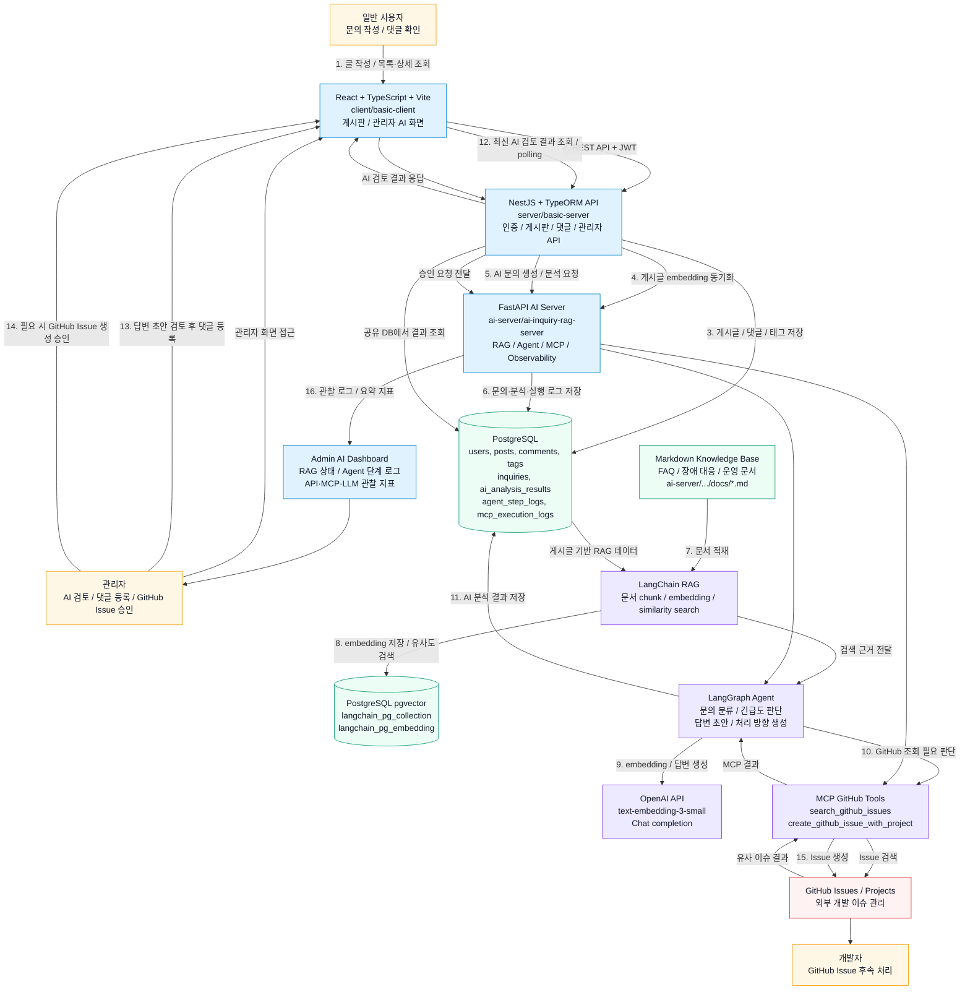

# AI Helpdesk Architecture Diagram

이 다이어그램은 AI Helpdesk 게시판의 주요 실행 흐름을 기준으로 정리한 아키텍처입니다.
사용자가 문의 게시글을 작성하면 NestJS가 게시판 데이터를 저장하고, FastAPI AI 서버가
RAG 검색, Agent 분석, MCP GitHub 연동을 처리합니다.

## 처리 순서

1. 일반 사용자가 React 화면에서 문의 게시글을 작성합니다.
2. React는 JWT를 포함해 NestJS API로 게시글, 댓글, AI 검토 요청을 보냅니다.
3. NestJS는 게시판 데이터를 PostgreSQL에 저장합니다.
4. 게시글 생성·수정 직후 NestJS가 FastAPI에 게시글 RAG embedding 동기화를 요청합니다.
5. NestJS는 게시글을 AI 문의로 변환하고 FastAPI Agent 분석을 백그라운드로 준비합니다.
6. FastAPI는 문의, AI 분석 결과, Agent/MCP/API 실행 로그를 같은 PostgreSQL에 저장합니다.
7. Markdown 문서와 게시글 데이터는 LangChain RAG의 검색 지식으로 적재됩니다.
8. RAG는 OpenAI embedding과 pgvector를 사용해 유사 문서를 검색합니다.
9. LangGraph Agent는 RAG 근거와 문의 본문을 기반으로 답변 초안과 처리 방향을 생성합니다.
10. GitHub 조회가 필요하다고 판단되면 MCP GitHub 도구로 유사 이슈를 검색합니다.
11. 분석 결과는 `ai_analysis_results`에 저장되고 React 관리자 화면에서 조회됩니다.
12. 관리자는 답변 초안을 댓글 입력창에 채워 수정한 뒤 등록할 수 있습니다.
13. 개발 작업이 필요하면 관리자가 승인 버튼을 눌러 GitHub Issue 생성을 실행합니다.
14. MCP 실행 결과와 실패 여부는 `mcp_execution_logs`에 남습니다.
15. 관리자 AI 화면은 RAG 상태, Agent 단계 로그, API/MCP/LLM 지표를 보여줍니다.

## 구성요소 요약

| 영역 | 경로 | 역할 |
|---|---|---|
| Frontend | `client/basic-client` | 게시판, 로그인, 관리자 AI 검토 UI |
| Backend API | `server/basic-server` | JWT 인증, 권한, 게시글·댓글·태그, AI 서버 프록시 |
| AI Server | `ai-server/ai-inquiry-rag-server` | RAG, Agent 분석, MCP GitHub 연동, 관찰 로그 |
| Database | `infra/postgres-pgvector` | PostgreSQL + pgvector Docker Compose와 초기 스키마 |
| Knowledge Base | `ai-server/ai-inquiry-rag-server/docs` | FAQ, 장애 대응, 운영 문서 RAG 소스 |
